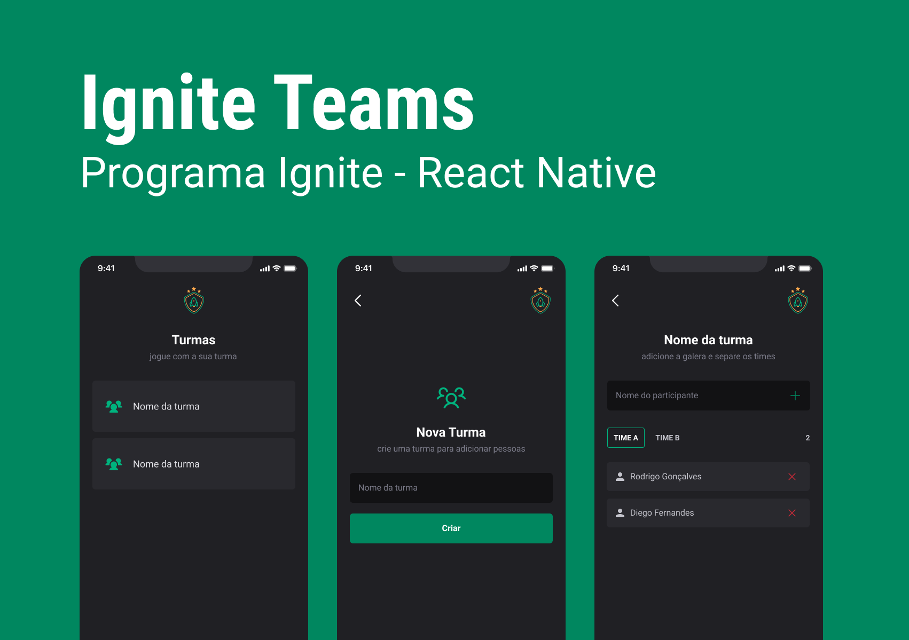

# :iphone: App - Ignite teams

- Project developed in module 2 - Of **React Native** from **Ignite** from [Rocketseat][rocketseat_site].

## :computer: About

Application that stores classes and players in certain teams.

## :wrench: Concepts

- States
- State immutability
- Lists and keys in React Native
- Properties
- Componentization

## :art: Layout



## :open_file_folder: How it works

### Pre-requisites
Before you begin, you will need to have the following tools installed on your machine: [Git] (https://git-scm.com), [Node.js] (https://nodejs.org/en/). In addition, it is good to have an editor to work with the code like [VSCode] (https://code.visualstudio.com/)

#### 🧭 Running the web application (Mobile)

```bash

# Clone this repository
$ git clone https://github.com/exodogurgel/ignite-teams.git

# Access the project folder in your terminal
$ cd ignite-teams-rn

# Install the dependencies
$ npm install

# Run the application in development mode
$ expo start

# Use ExpoGo to run the App

```

## 🛠 Tech Stack

This project was developed with the following technologies:

- [React Native][reactnative]
- [Expo][expo]
- [TypeScript][typescript]


## 🦸 Author

<a href="https://blog.rocketseat.com.br/author/exodo/">
  
 <br />
 <sub><b>Êxodo Gurgel</b></sub></a> <a href="https://blog.rocketseat.com.br/author/exodo/" title="Rocketseat"></a> 🚀
 <br />

[](https://www.linkedin.com/in/exodo-gurgel/) 
[](mailto:exodowellis@gmail.com)

---

## 📝 License

This project is under the license [MIT](./LICENSE).

Made with ❤️ by Êxodo Gurgel 👋🏽 [Get in Touch!](Https://www.linkedin.com/in/exodo-gurgel/)

---